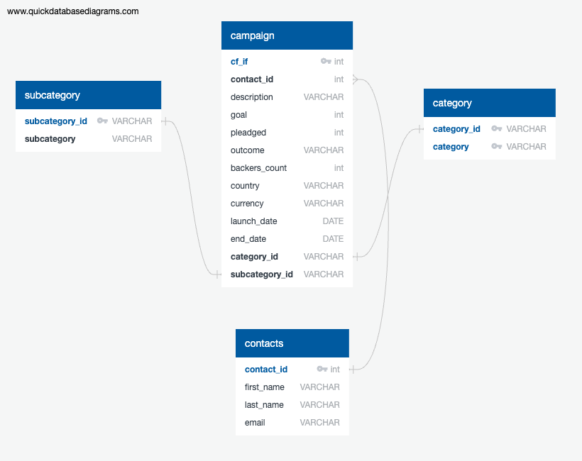

# Crowdfunding_ETL

Data Sources: crowdfunding.xlsx & contacts.xlsx

<ins>Crowdfunding Analysis</ins> 

In this project, I started by extracting data from 'crowdfunding.xlsx' and importing it into a DataFrame using pandas and numpy. One of my initial steps involved splitting the 'category' and 'subcategory' into separate columns, revealing that there were nearly three times as many subcategories as categories.

<ins>Campaign DataFrame</ins>

In Figures 2 and 3, I visualized the data to gain a better understanding of its structure.

To prepare the Campaign DataFrame, I followed the CRUD (Create, Read, Update, Delete) process. I renamed certain columns, converted 'goal' and 'pledged' columns to floats, and formatted the 'launch_date' and 'end_date' columns to datetime. Interestingly, the original date values had seconds as part of their unit, requiring me to account for this in my code to ensure accurate date parsing. I dropped unnecessary columns and exported the formatted data to a CSV file, as illustrated in Figure 4.

<ins>Contacts DataFrame</ins>

For the Contacts DataFrame, I opted for option 2 using regex to extract and organize the data. This was a great opportunity to practice my regex skills, even though crafting the regex pattern presented a challenge given my limited prior experience. I adjusted the data type for the 'contact_id' column and successfully extracted email addresses, first names, and last names into their respective columns. After cleaning up the data by removing unnecessary columns and reordering the information, I achieved the desired structure, shown in Figure 5.

<ins>ERD & Sql Databases<ins>
  
Regarding the ER Diagram and SQL databases, I initiated by creating the SQL DB tables. We quickly identified that the Campaign table would give us a variety of relationships to connect to (Foreign Keys) and thus we identified our primary key within this table (cf_id). As you can see from the ER Diagram contact id, subcategory_id were amongst some of the foreign keys identified. Notably, the Campaign table proved to be pivotal for establishing various relationships.

 
